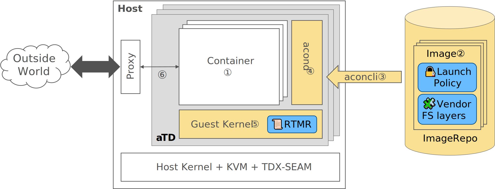

 # ACON - Attested Containers

ACON is an open source architecture and solution to create and manage small, purpose-built, [Intel TDX][intel-tdx]-protected virtual machines (called Trust Domains, or TDs for short) for running container-like workloads. ACON aims at maximizing the security benefits of Intel TDX while retaining compatibility with existing applications/tools. It is designed and optimized for cloud native use cases (e.g., containers and *FaaS* (**F**unction **a**s **a** **S**ervice), etc.).

## Goals

ACON is a container runtime.

From security perspective, ACON is designed to have

- Minimal TCB size.
- Minimal attack surface.
- Hardward based attestability of workloads and their runtime environment.

From functional perspective, ACON is designed to be

- Able to run existing (containerized) applications with minimal (or even no) changes.
- Compatible with existing compiler toolchains, libraries, and debugging tools - for easy development and debugging of new applications.
- Compatible with existing virtualization tools and container orchestration infrastructures - for easy integration with existing *CSP* (**C**loud **S**ervice **P**rovider) infrastructures.
- Optimized for containers and *FaaS* usages where an application may be comprised of components from different/independent vendors.

## Architecture Overview

The diagram blow depicts ACON's architecture at a highlevel, with its key components (highlighted in yellow) and unique (comparing to OCI compliant runtimes) features (highlighted in blue).

In a nutshell, ACON runs containers in a small purpose-built [TD][intel-tdx] (referred to as the ACON TD, or *aTD*). Below an introduction is provided to the numbered items in the diagram above.

1. ACON Containers (referred to as *Container*s in *italics* hereon) are namespace-separated Linux processes similar to "containers" as defined in [OCI Runtime][oci-runtime-spec] spec.
2. *Container*s are launched from [ACON Image](doc/Image.md)s (referred to as just *Image*s hereon), which are similar to [OCI Image][oci-image-spec]s but with new elements designed specifically for cloud confidential compute usages.
   - *Image*s are always digitally signed - This associates an *Image* with its vendor cryptographically, and is necessary to support *Vendor FS Layers* (described below).
   - 🧩*Vendor FS layer* refers to the mechanism that allows the vendor of an *FS* (**F**ile **S**ystem) layer to update the layer on behalf of the *Image* owner. In the case of *FaaS* for example, this allows a *CSP* to update its *FaaS* framework on behalf of the function author. Details are available in the [ACON Image](doc/Image.md#aliases) spec.
   - 🔏*Launch Policy* (referred to as *Policy* for short hereon) is a part of an *Image* (hence is digitally signed) and governs *aTD* sharing - i.e., 2 *Image*s can be loaded into the same *aTD* if and only if their *Policies* are mutually acceptable. In practice, this is usually used by *Image* authors for specifying dependencies among *Image*s. Details are available in the [ACON Image](doc/Image.md#launch-policy) spec.
3. `aconcli` is a command line utility. It is used to
   - Convert OCI images into *Image*s and store them into a directory of a specific structure, called an ACON Image Repo (or just *Repo* for short).
   - Sign *Image*s in a *Repo*.
   - Start *aTD*s.
   - Load *Image*s from a *Repo* into an *aTD* and launch them as *Containers* (by sending commands to `acond`).
4. `acond` accepts *Image*s from `aconcli` via its *gRPC* interface (over *VSOCK* or *TCP*). Then, it measures each *Image* (using 📜*RTMR*s) and launches them as *Container*s. `acond` is launched as the *`init`* process (*PID* `1`) at boot and is the only privileged process (in the *aTD*) in production.
   - 📜*RTMR* (**R**un**T**ime **M**easurement **R**egister) is a TDX specific feature - As of TDX v1.0, every TD is equipped with 4 *RTMR*s (namely, *RTMR0*..*3*) of 384 bits each. An *RTMR* cannot be set to any specific value but can be only *extended* by software (i.e., it works in the same way as a *PCR* does in a *TPM*).
5. The *Guest Kernel* is an Intel TDX-enlightened Linux kernel specifically [configured](doc/TDGuest.md#configuring-linux-kernel) for minimal attack surface and TCB.
6. *Containers* may communicate with the outside world through *TCP* or *VSOCK*. And in the latter case a proxy may be necessary to bridge *VSOCK* and other protocols to allow communication with remote hosts.

## Getting Started

See README.md files of [acond](acond/) and [aconcli](aconcli/) for build instructions.

[doc/TDGuest.md](doc/TDGuest.md) details how to build TD guest kernel and initrd images.

## License

This project is released under [Apache-2.0](LICENSE).

[intel-tdx]: https://www.intel.com/content/www/us/en/developer/articles/technical/intel-trust-domain-extensions.html
[oci-image-spec]: https://github.com/opencontainers/image-spec/blob/main/spec.md
[oci-runtime-spec]: https://github.com/opencontainers/runtime-spec/blob/main/spec.md
[cncf-coco]: https://www.cncf.io/projects/confidential-containers/
[kata-ccv0]: https://github.com/confidential-containers/kata-containers-CCv0