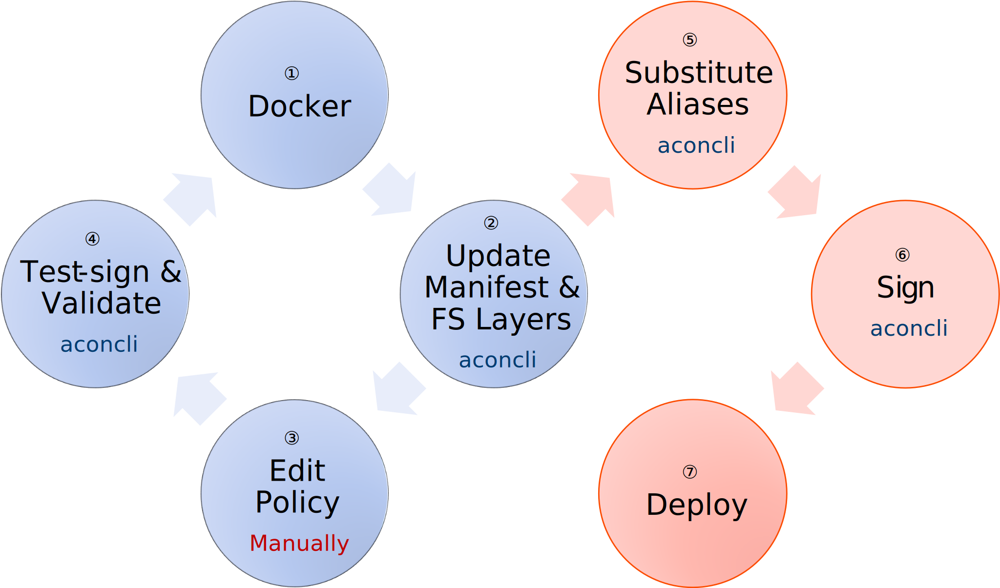
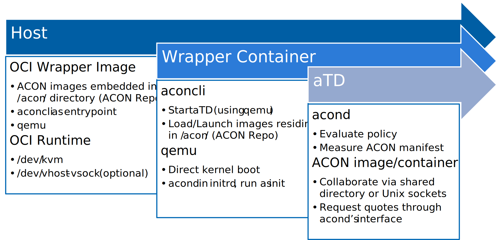

# Getting Started with ACON (Attested Containers)

## Building ACON Components
**Note**: Examples in this section assumes all ACON related files to be installed/stored in `~/acon`, which could be replaced by any directory path deemed suitable by the user.

### Building and Testing the Guest Kernel

You will need a working *aTD* (ACON TD) before launching ACON *Image*s. Booting an *aTD* requires a guest kernel and an initrd image.

1. See [Building Linux Kernel](TDGuest.md#building-linux-kernel) for instructions on configuring and building the guest kernel.

2. Assuming the kernel build directory is `/path/to/linux/build_dir`, the commands below install the kernel to `~/acon/kernels`.

   ```sh
   mkdir -p ~/acon/kernels
   make -C /path/to/linux/build_dir INSTALL_PATH=~/acon/kernels install
   ```

   Now the kernel binary should reside in `~/acon/kernels/` and be named `vmlinuz-VERSION`, where `VERSION` is the kernel version (e.g., `6.6.0-rc1`), optionally followed by the local version string (`CONFIG_LOCALVERSION`) and the git commit ID (`CONFIG_LOCALVERSION_AUTO`) if so configured in the build. A symlink named `vmlinuz` (i.e. `~/acon/kernels/vmlinuz`) is also created pointing to the kernel just installed.

3. Create an initrd image using the commands below.

   ```sh
   mkdir -p ~/acon/initrd.d
   . /path/to/acon_source/scripts/acon-build.env
   gen_initrd ~/acon/initrd.d/bbox busybox:uclibc
   ```

   The outcome of the above is an initrd image located in `~/acon/initrd.d/` and named `initrd-bbox.cpio`.

4. Test the kernel and initrd images by launching a VM and/or TD.

   The commands below launches a VM using [`acon-startvm`](../scripts/acon-startvm), which is the (default) script used by `aconcli` for creating TDs/VMs.

   ```sh
   ATD_RD=~/acon/initrd.d/initrd-bbox.cpio ATD_KERNEL=~/acon/kernels/vmlinuz /path/to/acon_source/scripts/acon-startvm
   ```

   **Note**: `acon-startvm` takes parameters in the form of environment variables, and displays values of all supported variables (prefixed with `ATD_`) before invoking *QEMU*.

   **Note**: `acon-startvm` relies on *QEMU* for creating TDs/VMs. The executable file name for *QEMU* is `qemu-kvm` by default, and can be overridden by setting the `ATD_QEMU` environment variable.

   On success, a command prompt will be brought up that resembles the following.

   ```
   NET: Registered PF_PACKET protocol family
   NET: Registered PF_VSOCK protocol family
   IPI shorthand broadcast: enabled
   sched_clock: Marking stable (119920635, 8171090)->(284204071, -156112346)
   Sending DHCP requests ., OK
   IP-Config: Got DHCP answer from 10.0.2.2, my address is 10.0.2.15
   IP-Config: Complete:
        device=eth0, hwaddr=52:54:00:12:34:56, ipaddr=10.0.2.15, mask=255.255.255.0, gw=10.0.2.2
        host=vm, domain=, nis-domain=(none)
        bootserver=10.0.2.2, rootserver=10.0.2.2, rootpath=
        nameserver0=10.0.2.3
   Freeing unused kernel image (initmem) memory: 1144K
   Write protecting the kernel read-only data: 8192k
   Freeing unused kernel image (rodata/data gap) memory: 1488K
   Run /init as init process
   '/etc/resolv.conf' -> '/proc/net/pnp'
   vm:/#
   ```

   To exit the VM, hit `Ctrl-a x` (See [*QEMU* Keys in the character backend multiplexer](https://www.qemu.org/docs/master/system/mux-chardev.html)).

   **Note**: The command above launches a regular VM. To launch a TD instead, just set `ATD` to any non-nil string.

   ```sh
   ATD=xyz ATD_RD=~/acon/initrd.d/initrd-bbox.cpio ATD_KERNEL=~/acon/kernels/vmlinuz /path/to/acon_source/scripts/acon-startvm
   ```

   **Note**: To ease distinguishing between regular VMs and TDs easily, the `/init` script (generated by `gen_initrd`) sets the shell prompt string (i.e., `PS1` environment variable) to `vm` for VMs, or `td-$ATD` for TDs.

   **Note**: Launching a TD requires a TDX platform (*Sapphire Rapids* or later), a TDX-enlightened host kernel and a TDX-enlightened *QEMU*.

   The command prompt of a TD will look the same as of a regular VM except the host name being `td-xyz` (i.e., `td-$ATD`, where `$ATD` is expanded to `xyz`) instead of `vm` in the previous case.

### Building `aconcli`

`aconcli` is the ACON command line interface and can be built using the commands below.

**Note**: Go 1.18 or higher is required. Please see [aconcli/README.md](../aconcli/README.md) for more details.

```sh
cd /path/to/acon_source/aconcli
go generate && go build
```

It'd be convenient to have `aconcli` in `$PATH`, which could be done by creating a symlink `~/bin/aconcli` pointing to the `aconcli` executable in its project's directory.

```sh
ln -srv /path/to/acon_source/aconcli/aconcli ~/bin/
```

`aconcli` supports shell completion. For [bash](https://www.gnu.org/software/bash/), the command below adds completion to the current shell.

```sh
. <(aconcli completion bash)
```

With `aconcli`, a VM can be started by the command below.

```sh
ATD_RD=~/acon/initrd.d/initrd-bbox.cpio ATD_KERNEL=~/acon/kernels/vmlinuz aconcli run -ni
```

**Note**: Instead of creating a TD/VM by itself, `aconcli` invokes an external (and potetially user-supplied) executable to accommodate different platform setups. By default, `aconcli` looks for an executable named `acon-startvm` in the same directory as `aconcli` resides, and that can be overridden by the `-f` command line flag.

**Note**: By default, `acon-startvm` looks in the same directory as it resides for `initrd.img` and `vmlinuz` to be the initial ramdisk image and kernel. The command above overrides those by setting `ATD_RD` and `ATD_KERNEL` environment variables.

### Building `acond` and Updating initrd Image

`acond` is the ACON Daemon - the process responsible for loading/measuring/starting ACON images inside an *aTD*. Instructions on building `acond` are given in [acond/README.md](../acond/README.md) to build `acond`.

After a successful build, the commands below update the initrd image to include `acond` and start it automatically inside an *aTD*.

```sh
# Assuming release build
cp /path/to/acon_source/acond/target/release/acond ~/acon/initrd.d/bbox/bin

. /path/to/acon_source/scripts/acon-build.env
INIT=/bin/acond gen_init ~/acon/initrd.d/bbox init
create_init ~/acon/initrd.d/bbox
```

The last command above generates (or overwrites if already existing) `~/acon/initrd.d/initrd-bbox.cpio`.

## Developing ACON Images

*ACON Image* follows the same design philosophy as the OCI Container Images, and that makes it possible to leverage existing container tools to assist in creating/modifying *acon Image*s.



The steps for developing an *ACON Image* is depicted above and also described below. The general idea is to create an OCI container image using existing tools, then convert that OCI image into an *ACON Image* with the help of `aconcli`. Please note [`docker`](https://www.docker.com/) is the only container tool supported at the moment, while supports for other container tools may be added in future.

1. Start out by building an OCI image using `docker`.
2. Invoke `aconcli generate` to convert the OCI image into an *ACON Image*, which is comprised of an *ACON Manifest* and one or more *FS layer*s.
3. Edit the *ACON Manifest* generated in the previous step as needed. For example, launch policy must be put in manually for now.
4. Invoke `aconcli sign` with a test-signing key to test-sign and `aconcli run` to launch/test the *Image* in an *aTD*. Then repeat step &#9312; to &#9315; as many times as necessary for developing, debugging and validating the *Image*.
5. Once the *ACON Image* is ready for release, invoke `aconcli alias-substitute` to substitute *FS layer*s with their *alias*es.
6. Sign the *ACON Image* by `aconcli sign` with the product signing key.
7. The *ACON Image* is now ready for deployment.

### Creating and Testing an ACON Image

Below is an example to demonstrate the workflow in practice. In this example we will create an *ACON Image* from the docker image [`busybox:uclibc`](https://hub.docker.com/_/busybox) and launch it as an *ACON Container* in interactive mode.

1. Download `busybox:uclibc` docker image.

   ```sh
   docker pull busybox:uclibc
   ```

2. Initialize an *ACON Repo* (for storing *ACON Image*s).

   ```sh
   cd ~/acon
   aconcli init
   ```

3. Convert `busybox:uclibc` docker image into an *ACON Image* (and store it in the *ACON Repo* initialized in the previous step).

   ```sh
   aconcli generate -i busybox:uclibc busybox.json
   ```

4. Edit the manifest to enable writable rootfs and add entry point.

   ```sh
   cat <<< $(jq '.writableFS=true | .entrypoint=["/bin/sh","-il"]' busybox.json) > busybox.json
   ```

5. Generate a signing key and certificate, and sign the *ACON Image*.

   ```sh
   openssl ecparam -name secp384r1 -genkey -out signer.pem
   openssl req -x509 -sha384 -outform der -key signer.pem -out signer.cer -subj /CN=testcert
   aconcli sign -c signer.cer -k signer.pem busybox.json
   ```

6. Run in interactive mode.

   ```sh
   ATD_RD=~/acon/initrd.d/initrd-bbox.cpio ATD_KERNEL=~/acon/kernels/vmlinuz aconcli run busybox.json -nic:5525
   ```

   The command above tries to start a VM and run the specified ACON image (`busybox.json`) in interactive mode.

   - `ATD_RD` and `ATD_KERNEL` must be pointing to the pathes of the initrd image and the kernel, respectively.
   - The command flag `n` requests to start a new VM.
   - The command flag `i` indicates interactive mide.
   - The command flag `c` specifies the network protocol and endpoint `acond` should be listening to. Here, `:5525` specifies `tcp` port `5525` of `localhost`.

   When started in interactive mode, `acond` provides a simple command prompt and will display its prompt `[Acond]:` shortly after the VM has finished starting. The `l` command lists all running containers while `e` can switch to the pseudo terminal of the specified container. `?` displays all supported commands. The screen snippet below demonstrates how to switch to the busybox terminal that were just started.

   ```
   [Acond]: ?
   list[l] -- List all the enclave pesudo terminals.
   enter[e] master -- Enter the specified enclave pesudo terminal. Press Ctrl+Alt+O and then x|X to back to acond command line.
   debug[d] -- Enter VM pesudo terminal for debug purpose if sh or bash exists.
   help[h|?] -- Show help messages.

   [Acond]: l
   master  slave
   14	/dev/pts/0
   [Acond]: e 14
   / #
   ```

   After you are done, hit `Ctrl-Alt-o x` to return to `acond` command prompt, or hit `Ctrl-a x` to terminate the VM.

### Modifying and Resigning an ACON Image

`busybox.json` generated by `aconcli` in the example above can be edited manually. In this section, we add a new UID to `busybox.json`, re-sign it, and test it using `setuidgid` command.

Firstly, add `100` as a valid UID (assuming `$PWD` is `~/acon` holding all files created earlier).

```sh
cat <<< $(jq '.uids=[100]' busybox.json) > busybox.json
```

Then, re-sign the ACON image.

```sh
aconcli sign busybox.json
```

**Note**: Given `busybox.json` has been signed before, the signing certificate and private key files don't have to be supplied again.

Thirdly, launch the container.

```sh
ATD_RD=~/acon/initrd.d/initrd-bbox.cpio ATD_KERNEL=~/acon/kernels/vmlinuz aconcli run busybox.json -nic:5525
```

Finally, switch to the container's console and test `setuidgid`.

```
[Acond]: l
master  slave
14	/dev/pts/0
[Acond]: e 14
/ # echo newuser:x:100:100:newuser:/home/newuser:/bin/false >> /etc/passwd
/ # setuidgid newuser id
uid=100(newuser) gid=100(users) groups=100(users)
/ #
```

## Deploying ACON Images

**TODO:** Incomplete section

- *ACON Image*s are not OCI compliant so cannot be stored in OCI registries directly.
- However, one or more *ACON Image*s can be wrapped in an *ACON Repo*, which can then be wrapped inside an OCI container image to be stored in existing OCI registries.
  - The entrypoint of the wrapper OCI image could be set to `aconcli`, which could then launch *ACON Container*s inside the OCI container, as depicted in the diagram below.
  - An added benefit of the wrapper OCI container is its ability to block processes out of its network namespace from connecting to the TCP socket of `acond`.


